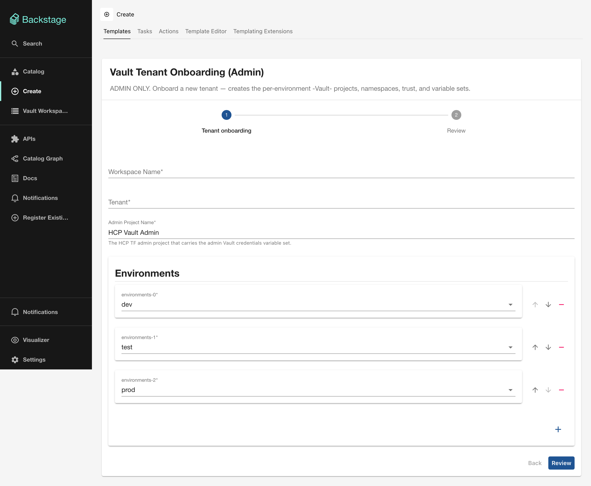

# L0: Vault tenant onboarding

The following screenshot shows the tenant onboarding form fields in Backstage.

!!! warning "Admin only"
    This template is intended for the platform team. It bootstraps the entire tenant structure that downstream templates depend on.

## What it does

Creates a new tenant in the Vault self-service platform by provisioning:

- Per-environment HCP Terraform projects (such as `acme-Vault-dev`, `acme-Vault-test`, `acme-Vault-prod`)
- Vault namespaces for each environment
- Trust relationships and variable sets carrying Vault credentials

This is always the **first step** when onboarding a new team or application domain.

## Terraform module

This card runs the [`terraform-vault-hcptf-onboarding`](../modules/hcptf-onboarding.md) module.

## Form fields

| Field | Required | Type | Description |
|-------|----------|------|-------------|
| **Workspace Name** | Yes | `string` | Unique name for the HCP Terraform workspace. Must match `^[A-Za-z0-9_-]+$`. |
| **Tenant** | Yes | `string` | Tenant identifier (2–32 chars, alphanumeric and hyphens). Used in project and namespace naming. |
| **Admin Project Name** | No | `string` | The HCP Terraform admin project carrying the Vault credentials variable set. Defaults to `HCP Vault Admin`. |
| **Environments** | No | `array` | Which environments to create. Checkboxes for `dev`, `test`, `prod`. Defaults to all three. |

## Output

After the scaffolder run completes, you receive:

- **HCP Terraform run status**: whether the apply succeeded
- **Link to the HCP Terraform Workspace**: the workspace managing this tenant
- **Link to the HCP Terraform Run**: the specific run that provisioned the resources

## What to do next

Once the tenant is onboarded, proceed to [L1: Trust onboarding](trust-onboarding.md) to mount auth backends for the tenant's clusters or GitLab instances.
