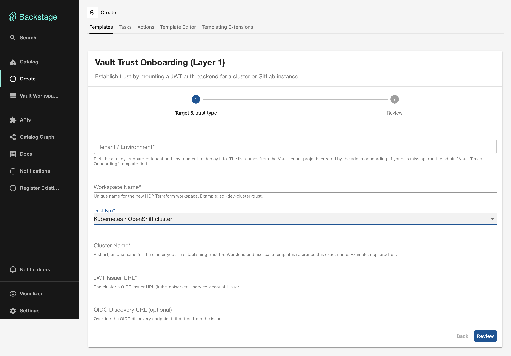
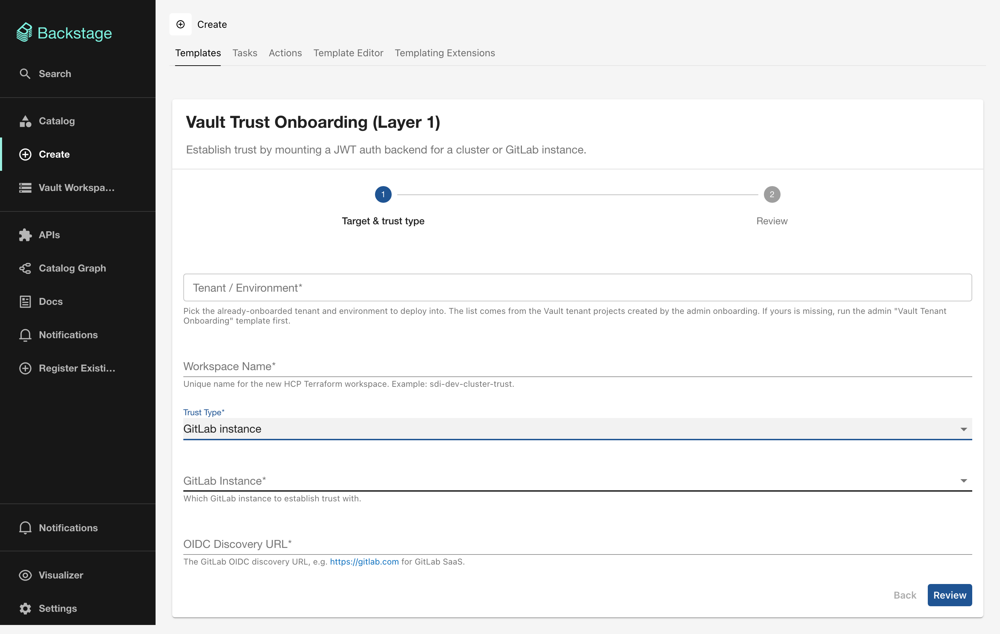

# L1: Vault trust onboarding

## What it does

Establishes OIDC trust between Vault and an external identity provider by mounting a JWT auth backend. This enables workloads from that provider to authenticate to Vault using their native tokens.

Two trust types are supported:

- **Kubernetes / OpenShift cluster**: uses the cluster's ServiceAccount OIDC issuer
- **GitLab instance**: uses GitLab CI/CD ID tokens

## Terraform modules

| Trust type | Module |
|-----------|--------|
| Kubernetes | [`terraform-vault-cluster-onboarding`](../modules/cluster-onboarding.md) |
| GitLab | [`terraform-vault-gitlab-onboarding`](../modules/gitlab-onboarding.md) |

## Form fields

### Common fields

| Field | Required | Type | Description |
|-------|----------|------|-------------|
| **Tenant / Environment** | Yes | Entity Picker | Select the tenant target created by L0. Filters to `vault-target` Resources. |
| **Workspace Name** | Yes | `string` | Unique HCP Terraform workspace name, such as `sdi-dev-cluster-trust`. |
| **Trust Type** | Yes | `enum` | `Kubernetes / OpenShift cluster` or `GitLab instance`. |

### Kubernetes-specific fields

The following fields appear when you set Trust Type to **Kubernetes / OpenShift cluster**.

| Field | Required | Type | Description |
|-------|----------|------|-------------|
| **Cluster Name** | Yes | `string` | Short unique cluster identifier, such as `ocp-prod-eu`. Downstream templates reference this name exactly. |
| **JWT Issuer URL** | Yes | `string` | The cluster's OIDC issuer URL (`kube-apiserver --service-account-issuer`). |
| **OIDC Discovery URL** | No | `string` | Override the OIDC discovery endpoint if it differs from the issuer. |

### GitLab-specific fields

The following fields appear when you set Trust Type to **GitLab instance**.

| Field | Required | Type | Description |
|-------|----------|------|-------------|
| **GitLab Instance** | Yes | `enum` | `cloud`, `dedicated-prod`, or `dedicated-dev`. |
| **OIDC Discovery URL** | Yes | `string` | The GitLab OIDC discovery URL, such as `https://gitlab.com` for GitLab SaaS. |

## Output

- **HCP Terraform run status**
- **Link to the HCP Terraform Workspace**
- **Link to the HCP Terraform Run**

## What to do next

With trust established, application teams can register their workloads using [L2: Workload onboarding](workload-onboarding.md).
