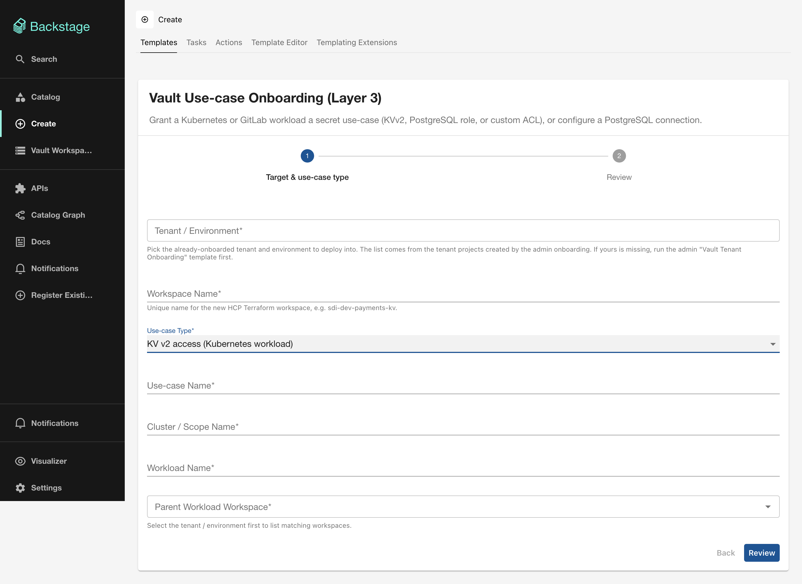
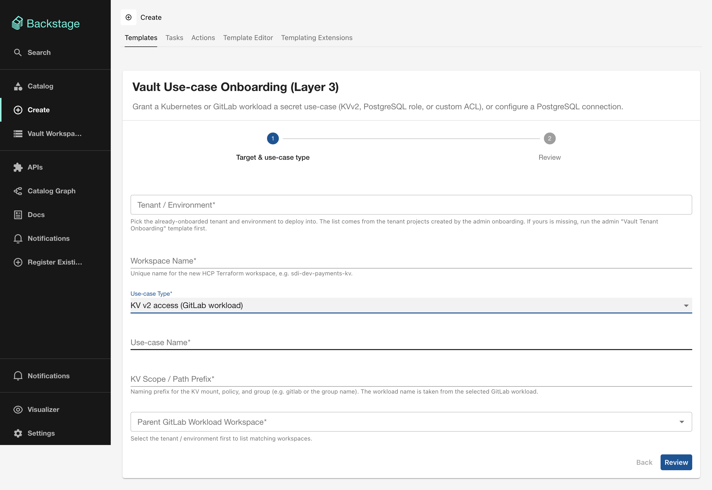
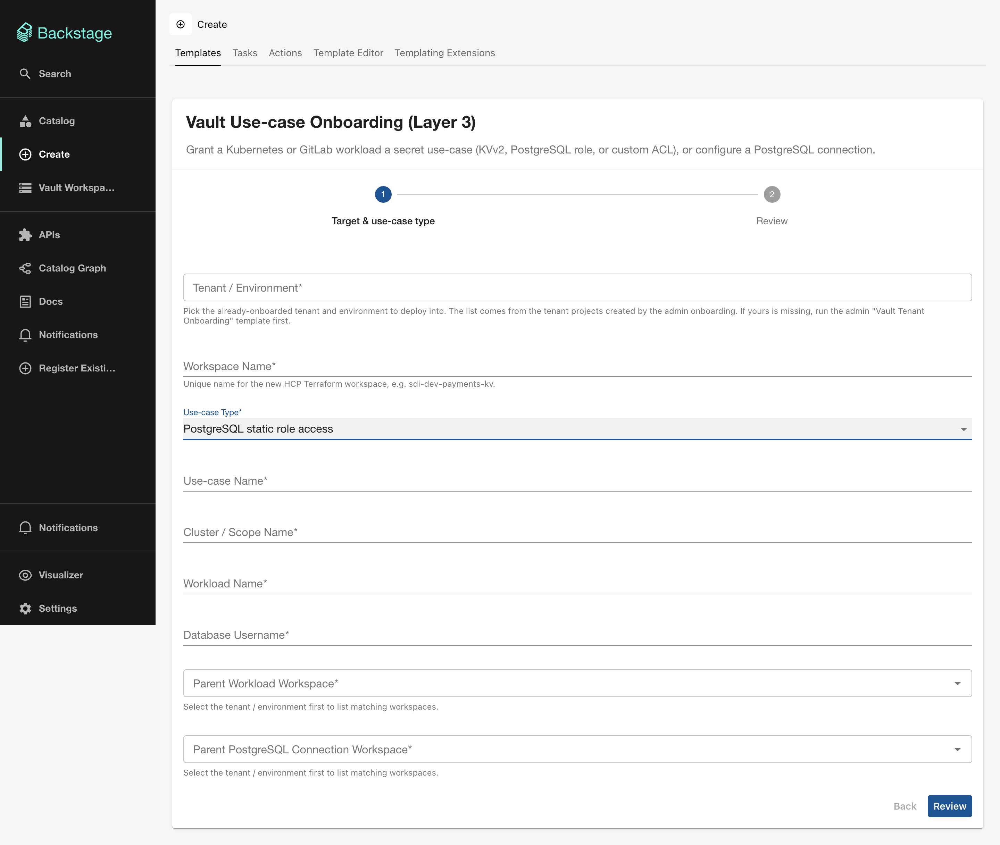
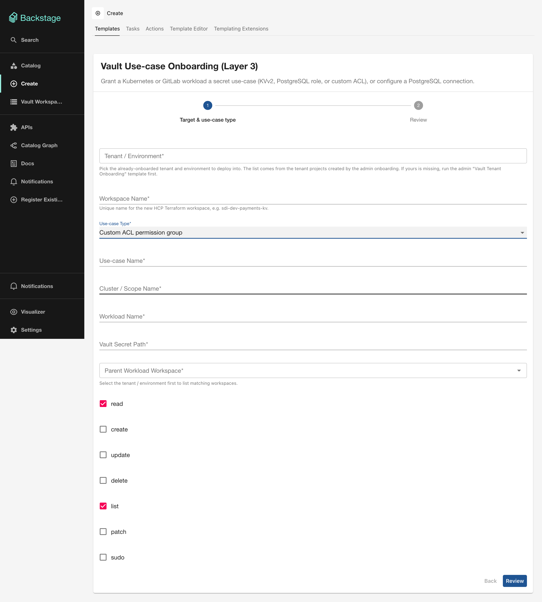
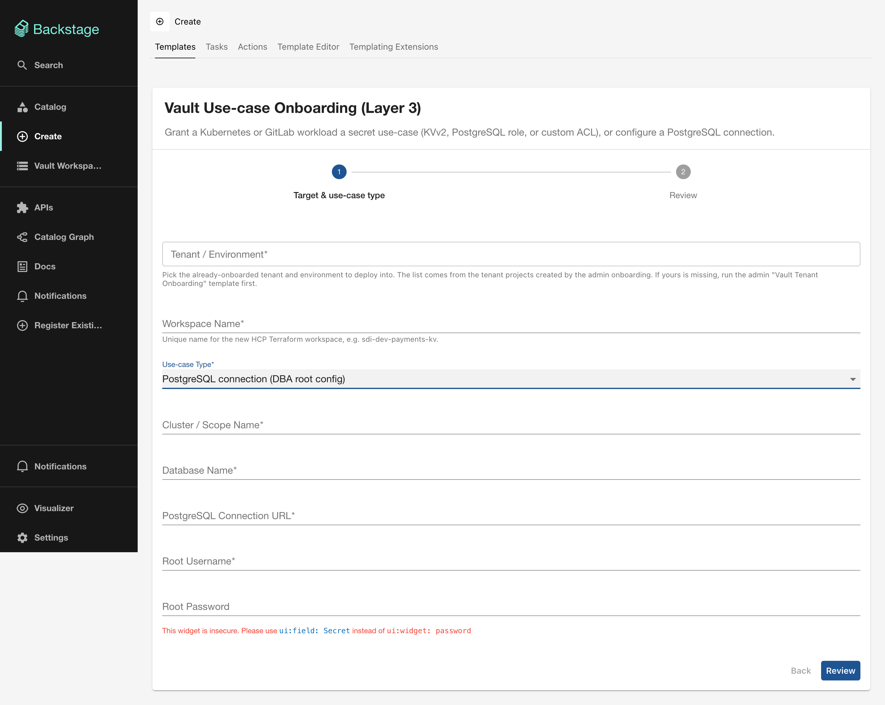

# L3 — Vault Use-case Onboarding

## What it does

Grants an onboarded workload access to a specific type of Vault secret. This is the final layer — it creates the policy, identity group binding, and (where applicable) the secret engine mount.

Five use-case types are supported:

| Use-case | Description | Module |
|----------|-------------|--------|
| **KV v2 (Kubernetes)** | KVv2 mount + read policy for a K8s workload | [`terraform-vault-add-kvv2`](../modules/add-kvv2.md) |
| **KV v2 (GitLab)** | KVv2 mount + read policy for a GitLab workload | [`terraform-vault-add-kvv2`](../modules/add-kvv2.md) |
| **PostgreSQL static role** | Database static role access through Vault DB engine | [`terraform-vault-add-pgsql-role`](../modules/add-pgsql-role.md) |
| **Custom ACL permission group** | Arbitrary Vault path capabilities | [`terraform-vault-add-permission-group`](../modules/add-permission-group.md) |
| **PostgreSQL connection (DBA)** | Root DB engine + connection setup | [`terraform-vault-pgsql-onboarding`](../modules/pgsql-onboarding.md) |

## Form fields

### Common fields

| Field | Required | Type | Description |
|-------|----------|------|-------------|
| **Tenant / Environment** | Yes | Entity Picker | Select the tenant target created by L0. |
| **Workspace Name** | Yes | `string` | Unique HCP TF workspace name, e.g. `sdi-dev-payments-kv`. |
| **Use-case Type** | Yes | `enum` | Selects which use-case to provision (see table above). |

### KV v2 (Kubernetes workload)

| Field | Required | Type | Description |
|-------|----------|------|-------------|
| **Use-case Name** | Yes | `string` | Identifier for this use-case, e.g. `app-config`. |
| **Cluster / Scope Name** | Yes | `string` | Must match the cluster name from L1. |
| **Workload Name** | Yes | `string` | Must match the workload name from L2. |
| **Parent Workload Workspace** | Yes | Scoped Entity Picker | The L2 Kubernetes workload workspace. |

### KV v2 (GitLab workload)

| Field | Required | Type | Description |
|-------|----------|------|-------------|
| **Use-case Name** | Yes | `string` | Identifier for this use-case. |
| **KV Scope / Path Prefix** | Yes | `string` | Naming prefix for the KV mount, policy, and group. |
| **Parent GitLab Workload Workspace** | Yes | Scoped Entity Picker | The L2 GitLab workload workspace. |

### PostgreSQL static role

| Field | Required | Type | Description |
|-------|----------|------|-------------|
| **Use-case Name** | Yes | `string` | Identifier for this use-case. |
| **Cluster / Scope Name** | Yes | `string` | Must match the cluster name from L1. |
| **Workload Name** | Yes | `string` | Must match the workload name from L2. |
| **Database Username** | Yes | `string` | The PostgreSQL username for the static role. |
| **Parent Workload Workspace** | Yes | Scoped Entity Picker | The L2 workload workspace. |
| **Parent PostgreSQL Connection Workspace** | Yes | Scoped Entity Picker | The L3 PostgreSQL connection workspace that backs this role. |

### Custom ACL permission group

| Field | Required | Type | Description |
|-------|----------|------|-------------|
| **Use-case Name** | Yes | `string` | Identifier for this use-case. |
| **Cluster / Scope Name** | Yes | `string` | Scope identifier. |
| **Workload Name** | Yes | `string` | Must match the workload name from L2. |
| **Vault Secret Path** | Yes | `string` | The Vault path to grant capabilities on. |
| **Parent Workload Workspace** | Yes | Scoped Entity Picker | The L2 workload workspace. |
| **read** | — | `boolean` | Default: `true` |
| **create** | — | `boolean` | Default: `false` |
| **update** | — | `boolean` | Default: `false` |
| **delete** | — | `boolean` | Default: `false` |
| **list** | — | `boolean` | Default: `true` |
| **patch** | — | `boolean` | Default: `false` |
| **sudo** | — | `boolean` | Default: `false` |

### PostgreSQL connection (DBA root config)

| Field | Required | Type | Description |
|-------|----------|------|-------------|
| **Cluster / Scope Name** | Yes | `string` | Scope identifier. |
| **Database Name** | Yes | `string` | Database identifier. |
| **PostgreSQL Connection URL** | Yes | `string` | Connection string for the database. |
| **Root Username** | Yes | `string` | Database admin username. |
| **Root Password** | Yes | `password` | Database admin password (masked in UI). |

!!! warning "Sensitive inputs"
    The PostgreSQL connection URL and root password are marked as sensitive variables in HCP Terraform and are never stored in Backstage or the catalog.

## Output

- **HCP Terraform run status**
- **Link to the HCP Terraform Workspace**
- **Link to the HCP Terraform Run**
