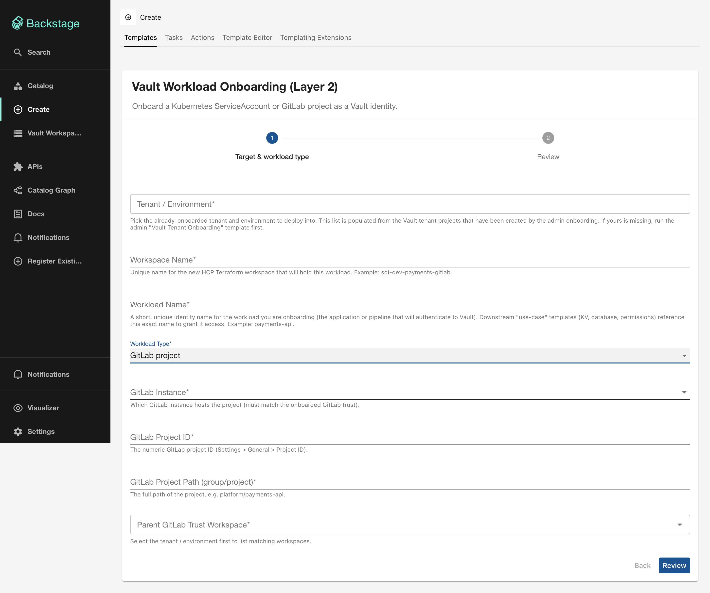

# L2 — Vault Workload Onboarding (Principal)

## What it does

Registers a workload principal — a Kubernetes ServiceAccount or a GitLab project — as a Vault identity entity. This creates the auth role and identity entity that use-case templates (L3) bind policies to.

Two workload types are supported:

- **Kubernetes / OpenShift ServiceAccount** — binds a namespace + service account to a Vault identity
- **GitLab project** — binds a GitLab project ID and path to a Vault identity

## Terraform modules

| Workload type | Module |
|--------------|--------|
| Kubernetes | [`terraform-vault-add-k8s-namespace-access`](../modules/add-k8s-namespace-access.md) |
| GitLab | [`terraform-vault-add-gitlab-project-access`](../modules/add-gitlab-project-access.md) |

## Form fields

### Common fields

| Field | Required | Type | Description |
|-------|----------|------|-------------|
| **Tenant / Environment** | Yes | Entity Picker | Select the tenant target created by L0. |
| **Workspace Name** | Yes | `string` | Unique HCP TF workspace name, e.g. `sdi-dev-payments-gitlab`. |
| **Workload Name** | Yes | `string` | Short identity name for the workload (the app or pipeline authenticating to Vault). Downstream L3 templates reference this name. |
| **Workload Type** | Yes | `enum` | `Kubernetes / OpenShift ServiceAccount` or `GitLab project`. |

### Kubernetes-specific fields

Shown when Workload Type = **Kubernetes / OpenShift ServiceAccount**:

| Field | Required | Type | Description |
|-------|----------|------|-------------|
| **Cluster Name** | Yes | `string` | Must match the `cluster_name` from the L1 trust onboarding. |
| **OCP / K8s Namespace** | Yes | `string` | The namespace the ServiceAccount runs in. |
| **ServiceAccount Name** | Yes | `string` | Name of the Kubernetes ServiceAccount to bind. |
| **Parent Trust Workspace** | Yes | Scoped Entity Picker | The L1 cluster trust workspace providing `jwt_auth_path` and `jwt_mount_accessor`. Scoped to the selected tenant. |

### GitLab-specific fields

Shown when Workload Type = **GitLab project**:

| Field | Required | Type | Description |
|-------|----------|------|-------------|
| **GitLab Instance** | Yes | `enum` | `cloud`, `dedicated-prod`, or `dedicated-dev`. Must match the L1 GitLab trust. |
| **GitLab Project ID** | Yes | `string` | Numeric project ID (Settings > General > Project ID in GitLab). |
| **GitLab Project Path** | Yes | `string` | Full path, e.g. `platform/payments-api`. |
| **Parent GitLab Trust Workspace** | Yes | Scoped Entity Picker | The L1 GitLab trust workspace. Scoped to the selected tenant. |

## Output

- **HCP Terraform run status**
- **Link to the HCP Terraform Workspace**
- **Link to the HCP Terraform Run**

## What to do next

With the workload registered, grant it access to secrets via [L3 — Use-case Onboarding](usecase-onboarding.md).
