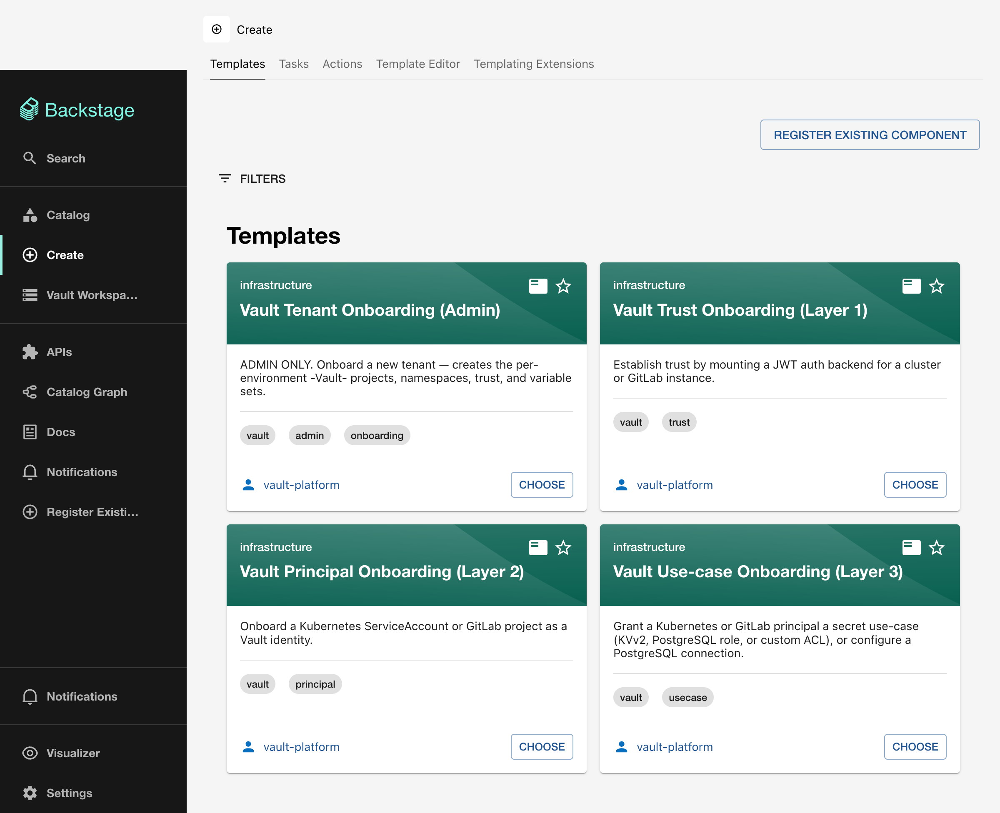

# Vault Self-Service Portal

The Vault Self-Service Portal is an internal developer platform (IDP) built on [Backstage](https://backstage.io/) and [HCP Terraform](https://www.hashicorp.com/products/terraform). It lets teams onboard workloads to HashiCorp Vault without writing Terraform or opening tickets. Every operation is a guided form that provisions infrastructure through no-code Terraform modules.

## How it works

The portal exposes four **template cards** on the Backstage `/create` page. Each card maps to a layer in the onboarding model:

| Layer | Card | Who runs it | What it does |
|-------|------|-------------|--------------|
| L0 | [Tenant Onboarding (Admin)](cards/admin-onboarding.md) | Platform team | Creates HCP Terraform projects, Vault namespaces, and variable sets for a new tenant |
| L1 | [Trust Onboarding](cards/trust-onboarding.md) | Platform team | Mounts a JWT auth backend for a Kubernetes cluster or GitLab instance |
| L2 | [Workload Onboarding](cards/workload-onboarding.md) | Application teams | Registers a K8s ServiceAccount or GitLab project as a Vault identity |
| L3 | [Use-case Onboarding](cards/usecase-onboarding.md) | Application teams | Grants KVv2, PostgreSQL, or custom ACL access to an onboarded workload |

Each template calls the `hcptf:nocode:provision` Backstage action, which creates an HCP Terraform workspace, applies a no-code module, and returns links to the workspace and run.

## For platform engineers

The templates are backed by **9 Terraform modules** documented in the [Terraform Modules](modules/index.md) section. Each module page covers inputs, outputs, derived values, and registry usage.

## Quick links

- [Architecture: the 4-layer model](architecture.md)
- [Getting started: prerequisites and first run](getting-started.md)
- [Template cards: step-by-step form guides](cards/index.md)
- [Terraform modules: reference documentation](modules/index.md)
- [Platform integration: adopt the components in your own Backstage instance](integration/index.md)
