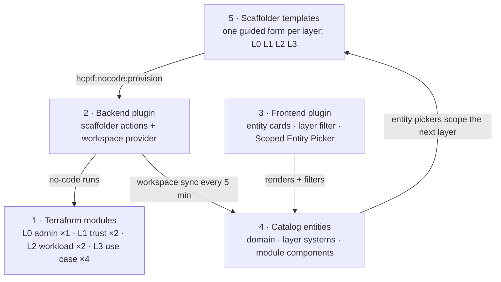

# Platform integration guide

This section explains how to adopt the Vault self-service components in your own Backstage instance: the two plugins install from GitHub Packages, and you copy the templates and catalog files from the reference portal into your app. If you do not already run Backstage, you do not need this section — the reference portal is a complete Backstage app, so fork it and follow [Getting started](../getting-started.md) instead.

Everything you install serves the portal's 4-layer onboarding model: L0 bootstraps a tenant, L1 establishes trust, L2 onboards workload identities, and L3 grants use-case access. The five components divide the work:



The numbers are the install order — each component depends on the ones before it. The table and the numbered list that follow carry the same information as the diagram:

| Component | What it provides |
|-----------|-----------------|
| [Terraform modules](terraform-modules.md) | Nine no-code Terraform modules published to the HCP Terraform private registry |
| [HCP Terraform backend plugin](plugin.md) | Scaffolder actions (`hcptf:nocode:provision`, `hcptf:outputs:read`, `hcptf:run:create`) and a catalog entity provider that syncs HCP Terraform workspaces into the Backstage catalog |
| [Vault frontend plugin](plugin-frontend.md) | Entity cards (Terraform outputs, next-layer navigation), a catalog layer filter, and the Scoped Entity Picker scaffolder field |
| [Catalog entities](catalog.md) | Domain, systems, module components, and org definitions that structure the catalog graph |
| [Scaffolder templates](templates.md) | Four template files (L0 through L3) that wire the plugin actions into guided forms |

## Get the source

Clone the reference portal to obtain the scaffolder templates, catalog files, and the verify script — the plugins themselves install from GitHub Packages:

```bash
git clone https://github.com/gitrgoliveira/vault-backstage.git
```

The portal is one of three projects in the reference workspace. The Terraform module sources live in the two sibling projects:

```text
self-service-vault/              # reference workspace root
├── terraform-vault-onboarding/  # 8 no-code Terraform modules (L1 through L3)
├── vault-backstage/             # this portal: plugins, templates, catalog, scripts
└── (admin bootstrap, private)   # L0 module + the Vault admin structure
```

The clone gives you `vault-backstage/` only. Each Terraform module also has its own public repository (`github.com/gitrgoliveira/terraform-vault-<module>`), so you can fork and publish them without the workspace layout. Only the admin bootstrap is private — the Vault structure it creates is documented as a specification in [HCP Vault prerequisites](terraform-modules.md#hcp-vault-prerequisites) so you can reproduce it with your own Terraform.

Paths in this section follow two conventions:

- Terraform module source paths (such as `terraform-vault-onboarding/terraform-vault-add-kvv2/`) are relative to the **workspace root**.
- Catalog location `target:` paths (such as `../../catalog/modules.yaml`) are relative to **your `packages/backend/` directory**.

## Integration order

Install the components in this order because each step depends on the previous one:

1. **[Publish Terraform modules](terraform-modules.md)** to your HCP Terraform private registry with no-code mode enabled.
2. **[Install the backend plugin](plugin.md)** and configure the `hcpTerraform` block in your `app-config.yaml`.
3. **[Install the frontend plugin](plugin-frontend.md)** and register its modules in your app.
4. **[Import catalog entities](catalog.md)** so the domain, systems, and module components appear in your catalog.
5. **[Register scaffolder templates](templates.md)** in your catalog locations so the template cards appear on the Create page.
6. **[Verify the integration](verify.md)** with the read-only preflight script and a portal walkthrough.

## Prerequisites

Before you begin, you need:

- A Backstage backend on the [new backend system](https://backstage.io/docs/backend-system/) (the backend plugin uses `createBackendModule`)
- A Backstage app on the [new frontend system](https://backstage.io/docs/frontend-system/) (`createApp` from `@backstage/frontend-defaults`). If your app still uses the classic frontend, plan the [app migration](https://backstage.io/docs/frontend-system/building-apps/migrating/) before you start — it is the largest prerequisite on this list.
- Node.js 22, 24, or 26 (we recommend 26)
- An HCP Terraform organization with a team token that has permissions to manage workspaces, projects, variable sets, and no-code modules
- A GitHub personal access token (classic) with the `read:packages` scope, to install the plugins from GitHub Packages
- An HCP Vault cluster with the `admin` namespace configured
- JWT auth mounts in the admin namespace for HCP Terraform dynamic provider credentials. Refer to [HCP Vault prerequisites](terraform-modules.md#hcp-vault-prerequisites) for the required structure.
